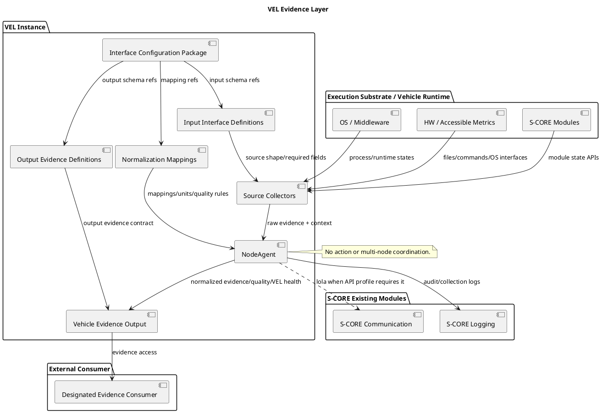
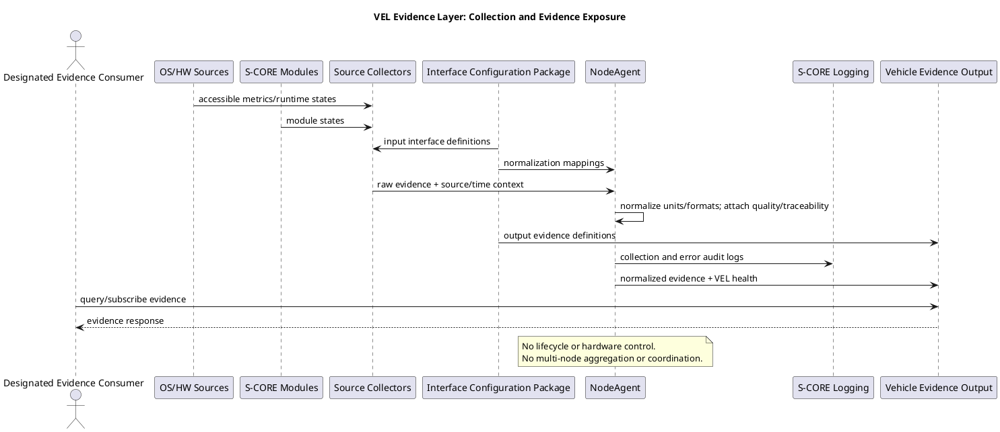

# VEL Architectural Design Draft

## 1. Scope Decision

VEL is a Vehicle Evidence Layer for S-CORE-based vehicle systems. It provides a normalized Vehicle Evidence interface as an independent open-source implementation.

VEL receives raw metrics, runtime states, events, faults, execution context, input interface definitions, output evidence definitions, and normalization mappings. It emits normalized Vehicle Evidence, evidence quality, and VEL health through an external interface.

VEL does not coordinate multiple nodes. Multi-node boot sequencing, application launch coordination, network configuration, and OEM vehicle decisions remain external responsibilities.

## 2. Design Position

VEL consumes accessible runtime/HW metrics, S-CORE states, and configured execution context. It produces normalized Vehicle Evidence with quality and VEL health metadata.

VEL uses files, commands, and supported OS interfaces for metric collection. Platform-specific collectors are isolated from the common Evidence Layer. VEL is an evidence producer only; it does not perform multi-node coordination.

Vehicle Evidence field names, source input shapes, and source-to-evidence mappings are externalized as configuration so heterogeneous sources can be unified without changing the common Evidence Layer.

## 3. Existing Module Reuse and Changes

| Pullpiri Module | VEL Role | Change |
| --- | --- | --- |
| NodeAgent | Collector host, source collection, and evidence publication | Extend; no action execution |
| MonitoringServer | Optional local metric collection utilities and monitoring conventions | Reuse selectively; not a central multi-node aggregator |
| SettingsService | Candidate basis for evidence-query endpoints | Reuse selectively |
| common::spec | Basis for evidence contract and schema definitions | Extend or replace with configuration-driven interface definitions |
| logservice, common::logd | Logging path | Replace with S-CORE Logging |
| rocksdbservice, common::etcd | Evidence persistence path when persistence is configured | Replace with S-CORE Persistency |
| ActionController | None | Excluded from VEL execution path |
| FilterGateway, StateManager, PolicyManager | None in initial VEL scope | Excluded; their coordination/policy responsibilities are external |

Source collectors execute inside the NodeAgent process hosting VEL. Input definitions, output definitions, and normalization mappings are loaded as configuration, not hard-coded into separately deployed services.

## 4. Component Responsibilities

| Component | Main Function | Business Peers | Infrastructure | Deployment |
| --- | --- | --- | --- | --- |
| NodeAgent | Host VEL collection, normalize/publish Vehicle Evidence | S-CORE modules, designated evidence consumer | S-CORE Communication/lola where applicable | With each VEL deployment |
| Source Collectors | Read easy metrics and S-CORE API state according to configured input definitions | OS, Runtime, S-CORE Modules | Files, commands, supported APIs | Inside VEL |
| Interface Configuration Package | Bind input definitions, output definitions, normalization mappings, and verification vectors | NodeAgent, Source Collectors | Deployed-environment configuration mechanism | Inside VEL |
| Input Interface Definitions | Define source input fields, types, and requiredness | Source Collectors | Configuration package | Inside VEL |
| Output Evidence Definitions | Define normalized Vehicle Evidence output fields | NodeAgent, Vehicle Evidence Output | Configuration package | Inside VEL |
| Normalization Mappings | Define source-to-evidence mapping, unit conversion, and quality rules | NodeAgent | Configuration package | Inside VEL |
| Vehicle Evidence Output | Expose evidence, quality, VEL health, and collection status | Designated evidence consumer | Deployed interface mechanism | Inside VEL |
| S-CORE Modules | Provide module states exposed by the deployed environment | NodeAgent | S-CORE APIs | External dependency |
| S-CORE Logging | Receive VEL audit and collection logs | NodeAgent | S-CORE Logging | External dependency |

## 5. Component Diagram (PlantUML)

## 6. Evidence Flow (PlantUML)

## 7. Open Design Items

- Confirm the input interface definition format, output evidence definition format, and normalization mapping format with the designated data-format stakeholder.
- Confirm the platform-specific collector interfaces and S-CORE API profiles for each deployment environment.
- Decide whether normalized evidence persistence and specific external transports are required by each integration.
