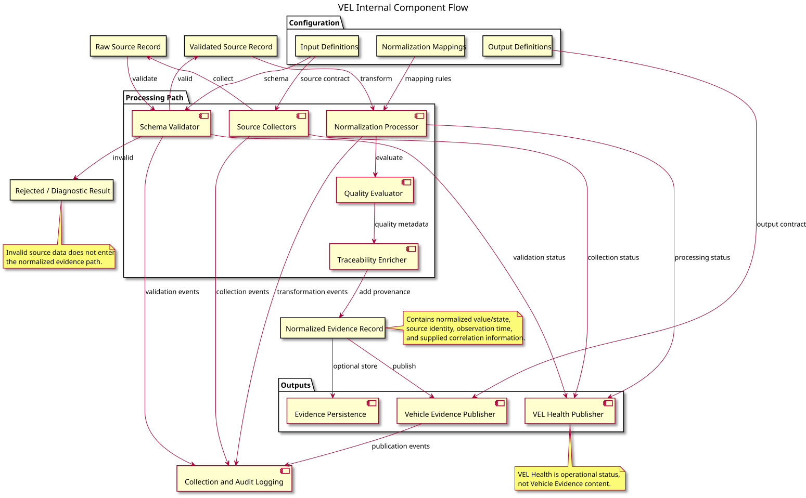

# Vehicle Evidence Layer Architectural Design Draft

## 1. Scope and Design Position

Vehicle Evidence Layer (VEL) collects configured runtime, hardware, and S-CORE module state information, normalizes heterogeneous source data, and exposes Vehicle Evidence to designated consumers.

VEL is an evidence producer. It does not perform multi-node coordination, boot sequencing, workload lifecycle execution, process or container control, hardware control, policy decisions, or final OEM vehicle decisions.

The architecture separates functional responsibilities from deployment. A deployment may host several VEL components in one process, but the functional boundaries remain explicit in the design.

## 2. Architecture Overview


[PlantUML source](../features/diagrams/VEL_architecture.puml)

The Vehicle Evidence Layer is organized into five functional areas:

- **Evidence Ingestion**: Source Collectors read configured runtime, hardware, and S-CORE state data through accessible files, commands, operating-system interfaces, or S-CORE APIs.
- **Evidence Processing**: Schema Validator checks source records; Normalization Processor applies configured mappings; Quality Evaluator assigns evidence quality; Traceability Enricher attaches source identity, observation time, and supplied correlation information.
- **Evidence Management**: Evidence Persistence stores normalized evidence only when persistence is configured for the deployment.
- **Evidence Publication**: Vehicle Evidence Publisher exposes the normalized evidence contract, while VEL Health Publisher exposes the health of the VEL collection pipeline.
- **Observability**: Collection and Audit Logging records collection, validation, normalization, and publication events without becoming part of the Vehicle Evidence contract.

## 3. Configuration Boundary

Configuration defines the source and evidence contracts:

- Input Interface Definitions describe source fields, types, and requiredness.
- Normalization Mappings describe source-to-evidence field mapping, unit conversion, state conversion, and quality rules.
- Output Evidence Definitions describe the normalized Vehicle Evidence fields exposed to consumers.

These artifacts allow a new source to be added through configuration and a platform-specific collector without changing common evidence processing behavior.

## 4. Component Responsibilities

| Component | Responsibility | Boundary |
| --- | --- | --- |
| Source Collectors | Read configured source data and provide source context | Platform-specific implementation; no normalization policy |
| Schema Validator | Validate source records against input definitions | Reject or diagnose invalid source data |
| Normalization Processor | Transform source representations into Vehicle Evidence representations | Applies configuration; does not make OEM decisions |
| Quality Evaluator | Attach validity, freshness, completeness, and mapping quality | Describes evidence quality; does not interpret vehicle behavior |
| Traceability Enricher | Attach source identity, observation time, and supplied correlation information | Preserves provenance of observations |
| Evidence Persistence | Store normalized evidence when configured | Optional deployment capability |
| Vehicle Evidence Publisher | Expose normalized Vehicle Evidence through the configured output interface | Evidence publication only |
| VEL Health Publisher | Expose collection and processing health | VEL operational status only |
| Collection and Audit Logging | Record operational and audit events | Separate from evidence content |

## 5. S-CORE Integration


[PlantUML source](../features/diagrams/SCORE_architecture_with_VEL.puml)

VEL uses S-CORE services only at their applicable boundaries:

- S-CORE Modules provide observable module state through APIs exposed by the deployed environment.
- S-CORE Communication may be used where the applicable communication profile requires it.
- S-CORE Logging receives VEL collection and audit logs.
- S-CORE Persistency may provide configured evidence persistence.

These integrations do not turn VEL into a coordinator, controller, policy manager, or decision-maker.

## 6. VEL Internal Component Flow



[PlantUML source](../features/diagrams/VEL_internal_component_flow.puml)

This view focuses on the internal processing flow rather than repeating the architecture overview. It shows the data artifacts at each stage, the invalid-record diagnostic path, and the separation between normalized Vehicle Evidence, optional persistence, VEL Health, and operational logging.

```text
source data
    -> schema validation
    -> normalization
    -> quality evaluation
    -> traceability enrichment
    -> persistence and/or publication
```

Logging observes this flow, while configuration supplies the contracts and rules used by each processing step.

## 7. Evidence Content Map


[PlantUML source](../features/diagrams/VEL_evidence_state_matrix.puml)

This map explains why different source categories require different processing rules. Runtime metrics are primarily unit- and range-oriented; hardware data may represent a measurement or an operational state; S-CORE data is commonly state-based; events and faults require code and severity handling; and execution context supplies identity and correlation information. The output is always normalized Vehicle Evidence with the applicable quality and traceability metadata.

The lower part of the map separates cross-cutting output from source-specific transformation: evidence quality describes the observation, VEL Health describes the VEL pipeline, and publication exposes the normalized output through the configured interface.

## 8. Open Design Items

- Confirm the input interface definition, output evidence definition, and normalization mapping formats with the responsible data-format stakeholders.
- Confirm platform-specific collector interfaces and S-CORE API profiles for each deployment environment.
- Decide whether normalized evidence persistence and specific external transports are required for each integration.
