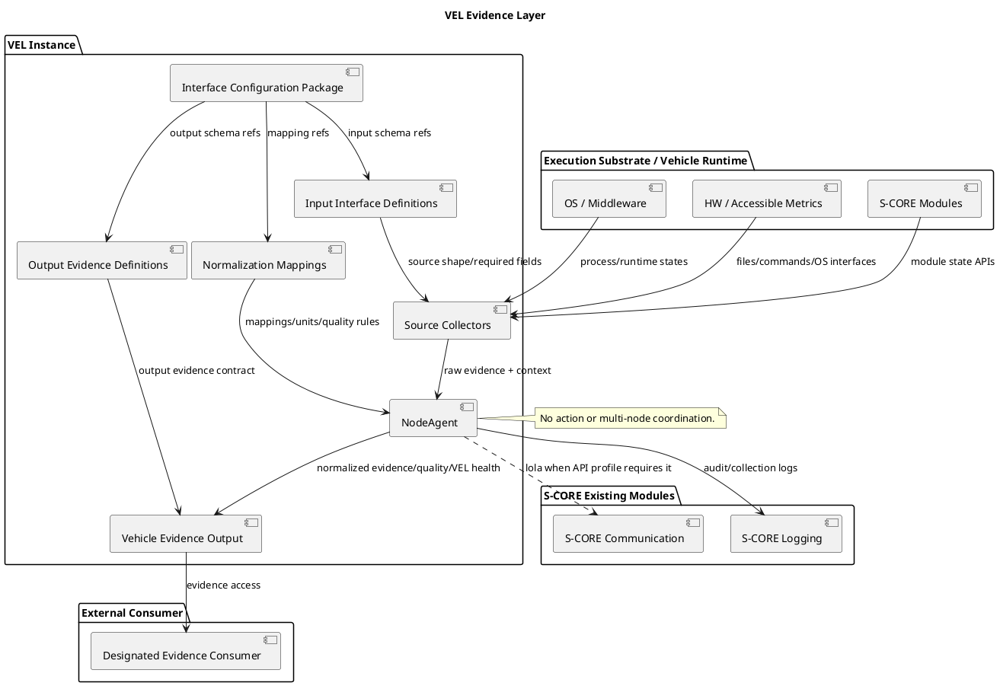
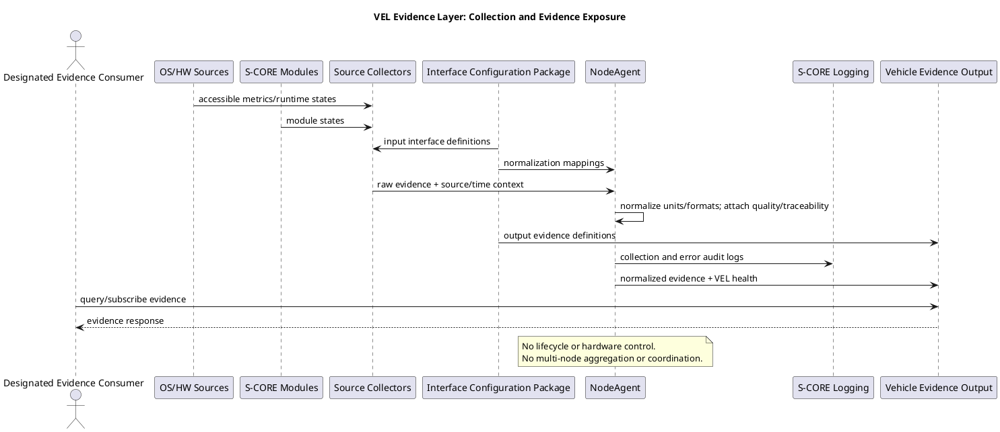

# VEL 개략설계 초안

## 1. 범위 결정

VEL은 S-CORE 기반 차량 시스템용 Vehicle Evidence Layer다. normalized Vehicle Evidence interface를 제공하는 독립적인 open-source 구현으로 개발한다.

VEL은 raw metric, runtime state, event, fault, execution context, input interface definition, output evidence definition 및 normalization mapping을 입력받아 정규화된 Vehicle Evidence, evidence quality, VEL health를 external interface로 출력한다.

VEL은 multi-node를 조정하지 않는다. multi-node boot sequence, app launch coordination, network configuration 및 OEM 차량 의사결정은 외부 책임으로 둔다.

## 2. 설계 방향

VEL은 접근 가능한 runtime/HW metric, S-CORE state 및 구성된 execution context를 수집한다. VEL은 quality와 VEL health metadata가 포함된 normalized Vehicle Evidence를 출력한다.

VEL은 metric 수집에 file, command, 지원 OS interface를 사용한다. common Evidence Layer에서 platform-specific collector를 분리한다. VEL은 evidence producer만 담당하며 multi-node coordination을 수행하지 않는다.

Vehicle Evidence field name, source input shape, source-to-evidence mapping은 configuration으로 분리하여 common Evidence Layer 변경 없이 이기종 source를 통일할 수 있게 한다.

## 3. 기존 모듈 재사용 및 변경

| Pullpiri 모듈 | VEL 역할 | 변경 |
| --- | --- | --- |
| NodeAgent | collector host, source collection, evidence publication | 확장; action 실행 금지 |
| MonitoringServer | 선택적 로컬 metric 수집 utility 및 monitoring convention | 선택적 재사용; 중앙 multi-node aggregator로 사용하지 않음 |
| SettingsService | evidence-query endpoint 후보 기반 | 선택적 재사용 |
| common::spec | evidence contract 및 schema 정의 기반 | configuration-driven interface definition으로 확장 또는 대체 |
| logservice, common::logd | logging path | S-CORE Logging으로 대체 |
| rocksdbservice, common::etcd | configured persistence 시 evidence 저장 경로 | S-CORE Persistency로 대체 |
| ActionController | 없음 | VEL 실행 경로에서 제외 |
| FilterGateway, StateManager, PolicyManager | 초기 VEL 범위에서 없음 | coordination/policy 책임은 외부로 제외 |

source collector는 NodeAgent 기반 VEL process 내부에서 실행한다. input definition, output definition, normalization mapping은 별도 배포 service가 아니라 configuration으로 load한다.

## 4. 컴포넌트 책임

| 컴포넌트 | 주요 기능 | 업무 통신 대상 | 연계 인프라 | 배포 |
| --- | --- | --- | --- | --- |
| NodeAgent | VEL collection host, Vehicle Evidence 정규화/발행 | S-CORE module, 지정된 evidence consumer | 필요 시 S-CORE Communication/lola | VEL 배포 단위 |
| Source Collector | configured input definition에 따라 easy metric 및 S-CORE API state 조회 | OS, Runtime, S-CORE Modules | file, command, 지원 API | VEL 내부 |
| Interface Configuration Package | input definition, output definition, normalization mapping, verification vector 연결 | NodeAgent, Source Collector | 배포 환경의 configuration mechanism | VEL 내부 |
| Input Interface Definition | source input field, type, requiredness 정의 | Source Collector | configuration package | VEL 내부 |
| Output Evidence Definition | normalized Vehicle Evidence output field 정의 | NodeAgent, Vehicle Evidence Output | configuration package | VEL 내부 |
| Normalization Mapping | source-to-evidence mapping, unit conversion, quality rule 정의 | NodeAgent | configuration package | VEL 내부 |
| Vehicle Evidence Output | evidence, quality, VEL health, collection status 노출 | 지정된 evidence consumer | 배포 환경의 interface mechanism | VEL 내부 |
| S-CORE Modules | 배포 환경에서 노출되는 module state 제공 | NodeAgent | S-CORE API | 외부 dependency |
| S-CORE Logging | VEL audit/collection log 수신 | NodeAgent | S-CORE Logging | 외부 dependency |

## 5. 컴포넌트 다이어그램 (PlantUML)

## 6. Evidence Flow (PlantUML)

## 7. 미결 설계 항목

- 지정된 data-format 이해관계자와 input interface definition, output evidence definition, normalization mapping format 확정
- 각 배포 환경의 platform-specific collector와 S-CORE API profile 확인
- normalized evidence persistence 및 특정 external transport가 integration별로 필요한지 결정
