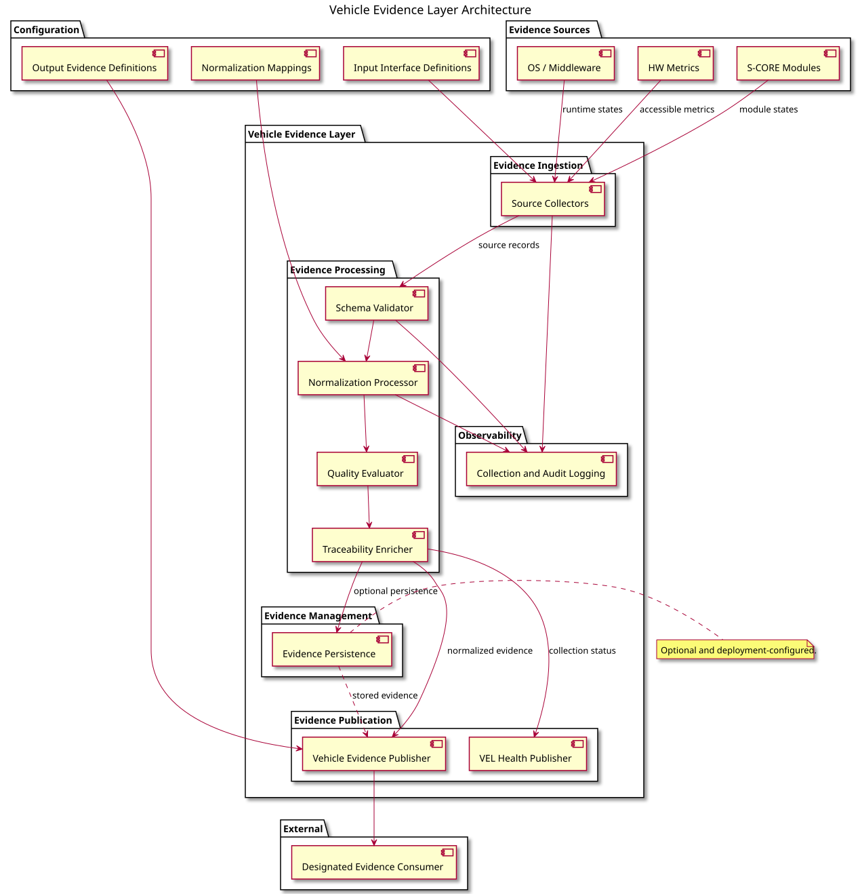
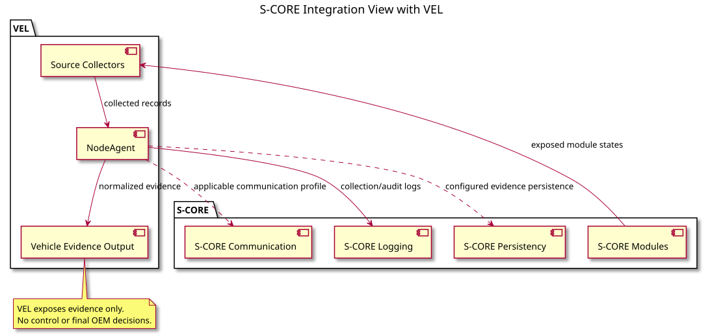
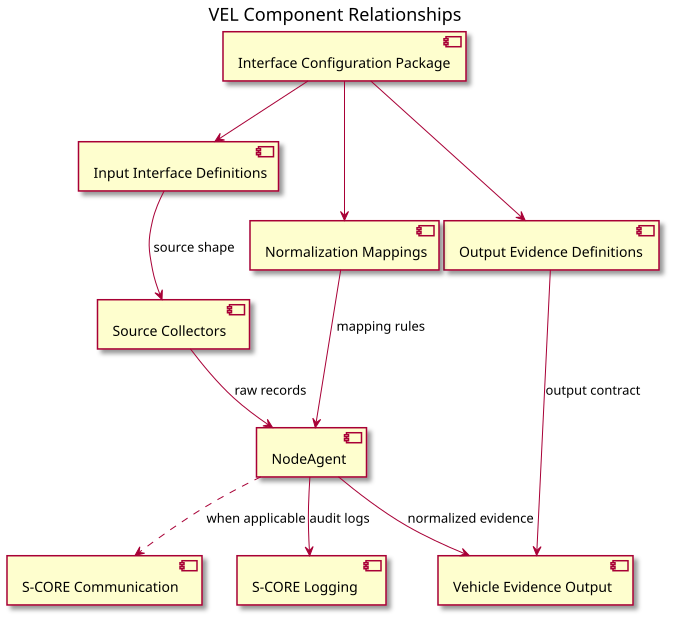

# Vehicle Evidence Layer 개략설계 초안

## 1. 범위와 설계 방향

Vehicle Evidence Layer(VEL)은 구성된 runtime, hardware 및 S-CORE 모듈 상태 정보를 수집하고, 이기종 source 데이터를 정규화하여 지정된 consumer에게 Vehicle Evidence를 노출한다.

VEL은 evidence producer다. VEL은 multi-node coordination, boot sequence, workload lifecycle 실행, process/container 제어, hardware 제어, policy 결정 및 OEM 최종 차량 의사결정을 수행하지 않는다.

배포 방식과 기능 경계를 구분한다. 하나의 process가 여러 VEL 컴포넌트를 호스팅할 수 있지만, 설계에서는 각 기능 경계를 명시적으로 유지한다.

## 2. 아키텍처 개요



[PlantUML 원본](../features/diagrams/VEL_architecture.puml)

Vehicle Evidence Layer는 다음 다섯 기능 영역으로 구성된다.

- **Evidence Ingestion**: Source Collector가 file, command, 지원 OS interface 또는 S-CORE API를 통해 구성된 runtime, hardware 및 S-CORE state를 읽는다.
- **Evidence Processing**: Schema Validator가 source record를 검증하고, Normalization Processor가 mapping을 적용하며, Quality Evaluator가 evidence quality를 부여하고, Traceability Enricher가 source identity, observation time 및 제공된 correlation 정보를 추가한다.
- **Evidence Management**: 배포 환경에서 persistence를 구성한 경우에만 정규화된 evidence를 저장한다.
- **Evidence Publication**: Vehicle Evidence Publisher가 normalized Vehicle Evidence contract를 노출하고, VEL Health Publisher가 VEL 수집 pipeline의 health를 노출한다.
- **Observability**: Collection and Audit Logging이 수집, 검증, 정규화 및 발행 event를 기록하며 Vehicle Evidence contract와는 분리된다.

## 3. Configuration 경계

Configuration은 source와 evidence contract를 정의한다.

- Input Interface Definition은 source field, type 및 requiredness를 정의한다.
- Normalization Mapping은 source-to-evidence field mapping, unit conversion, state conversion 및 quality rule을 정의한다.
- Output Evidence Definition은 VEL이 consumer에게 노출하는 normalized Vehicle Evidence field를 정의한다.

이를 통해 새로운 source를 추가할 때 common evidence processing behavior를 변경하지 않고 configuration과 platform-specific collector를 확장할 수 있다.

## 4. 컴포넌트 책임

| 컴포넌트 | 책임 | 경계 |
| --- | --- | --- |
| Source Collector | 구성된 source data와 source context를 읽는다 | platform-specific 구현이며 normalization policy를 결정하지 않는다 |
| Schema Validator | input definition에 따라 source record를 검증한다 | 잘못된 source data를 reject하거나 진단한다 |
| Normalization Processor | source representation을 Vehicle Evidence representation으로 변환한다 | configuration을 적용하며 OEM 결정을 내리지 않는다 |
| Quality Evaluator | validity, freshness, completeness 및 mapping quality를 부여한다 | evidence quality를 설명하며 차량 동작을 해석하지 않는다 |
| Traceability Enricher | source identity, observation time 및 제공된 correlation 정보를 추가한다 | observation provenance를 보존한다 |
| Evidence Persistence | 구성된 경우 normalized evidence를 저장한다 | 선택적 deployment capability다 |
| Vehicle Evidence Publisher | 구성된 output interface를 통해 normalized Vehicle Evidence를 노출한다 | evidence publication만 담당한다 |
| VEL Health Publisher | collection 및 processing health를 노출한다 | VEL operational status만 담당한다 |
| Collection and Audit Logging | operational 및 audit event를 기록한다 | evidence content와 분리된다 |

## 5. S-CORE 연계



[PlantUML 원본](../features/diagrams/SCORE_architecture_with_VEL.puml)

VEL은 다음 경계에서만 S-CORE service를 사용한다.

- S-CORE Modules는 배포 환경이 노출한 API를 통해 관측 가능한 module state를 제공한다.
- 적용 가능한 communication profile이 요구하는 경우 S-CORE Communication을 사용할 수 있다.
- S-CORE Logging은 VEL collection 및 audit log를 수신한다.
- 구성된 evidence persistence가 필요한 경우 S-CORE Persistency를 사용할 수 있다.

이 연계는 VEL을 coordinator, controller, policy manager 또는 decision-maker로 만들지 않는다.

## 6. 컴포넌트 관계



[PlantUML 원본](../features/diagrams/VEL_component_relationship.puml)

처리 순서는 다음과 같다.

```text
source data
    -> schema validation
    -> normalization
    -> quality evaluation
    -> traceability enrichment
    -> persistence and/or publication
```

Logging은 이 흐름을 관찰하고, configuration은 각 처리 단계가 사용하는 contract와 rule을 제공한다.

## 7. 미결 설계 항목

- 담당 data-format 이해관계자와 input interface definition, output evidence definition 및 normalization mapping format 확정
- 각 배포 환경의 platform-specific collector interface 및 S-CORE API profile 확인
- integration별 normalized evidence persistence 및 특정 external transport 필요 여부 결정
